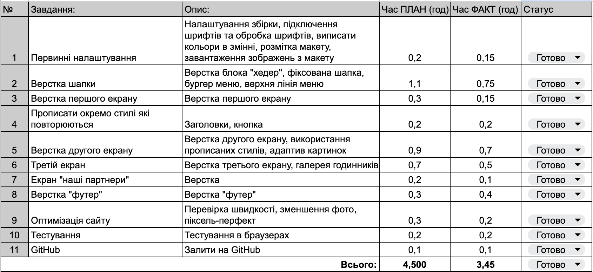

# Yaroslav Kobets - Space Lab test task

## [Посилання на розгорнутий проект](https://yaroslavkobets.github.io/SpaceLab-test-task/)

## Завдання

Виконати адаптивну верстку лендингу годинника по дизайн макету

> (мобільний дизайн окремо не надається, необхідно самостійно адаптувати роботу під мобільні екрани)

## Стек технологій

HTML / CSS / JS / Swiper

## Figma

[Figma LP PORTEN](<https://www.figma.com/file/K7yj5wOQe35dIPuvSepJ7F/LP-PORTEN-(SpaceLab)>)

## Зведення

